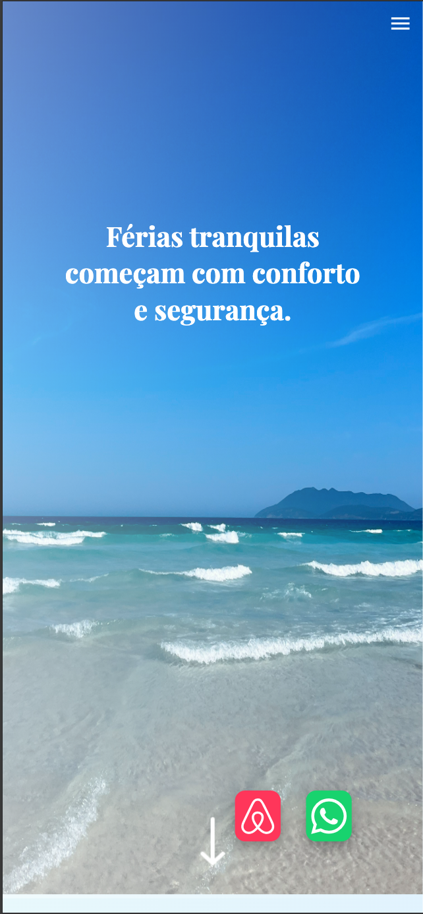

# Apartamento em Cabo Frio - Landing Page

## Tabela de Conteúdos
 - [O Site](#O-site)
 - [Capturas de Tela](#Capturas-de-tela)
 - [Funcionalidades](#functionalidades)
 - [Destaques do Processo](#Destaques-do-processo)
 - [Desenvolvido com](#Desenvolvido-com)

 - [Link](#Link)
 - [Autor](#Link)

### O Site
Uma landing page responsiva de um apartamento disponível para locação.

### Capturas de tela

 
 

### Funcionalidades
O usuário pode navegar pelos diferentes menus da página, que apresentam informações relevantes sobre o apartamento. Na seção de galeria, é possível visualizar as fotos disponíveis e abrir um modal que amplia a imagem, acompanhado da descrição do respectivo cômodo.
Na seção de comodidades, um efeito de acordeão permite ao usuário explorar os itens disponíveis em cada ambiente de forma organizada.
Caso deseje mais informações ou queira realizar uma reserva, o usuário pode clicar no ícone do Airbnb para ser redirecionado à plataforma, ou no ícone do WhatsApp para entrar em contato direto com o proprietário e esclarecer eventuais dúvidas.

### Ferramentas

O site foi desenvolvido utilizando HTML5, CSS3 e JavaScript. As imagens foram fornecidas pelo proprietário, enquanto as fontes e os ícones foram obtidos por meio do Google Fonts e FontAwesome. Os depoimentos e as comodidades foram extraídos diretamente da página do apartamento no Airbnb.

A responsividade para dispositivos móveis foi implementada com o uso de media queries, garantindo uma boa experiência em diferentes tamanhos de tela.

### Destaques do Processo
Os maiores desafios estiveram na criação do design da página, buscando transmitir a sensação de praia e a brisa típica da Região dos Lagos. A paleta de cores foi desenvolvida com base na imagem central do site — uma fotografia da praia próxima ao apartamento.
O processo de adicionar ícones personalizados para cada uma das comodidades exigiu bastante atenção, assim como a criação da lógica de navegação no carrossel de imagens.

No final, o projeto representou uma excelente oportunidade para aprimorar minhas habilidades em desenvolvimento Front-End, além de resultar em um projeto real para o portfólio: uma landing page funcional, que contribui para um processo de locação mais seguro e confiável. 

### Desenvolvido com
- HTML 5
- CSS 3
- JavaScript

### Link
https://apartment-landing-page-k8xenihnc-rafaels-projects-3b81a1b9.vercel.app

### Autor
Rafael Gevu
